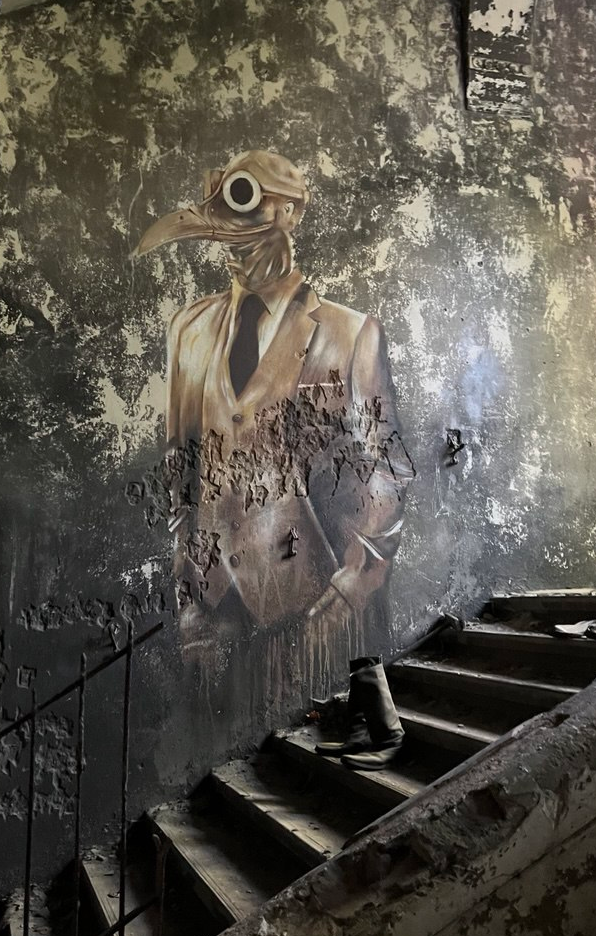
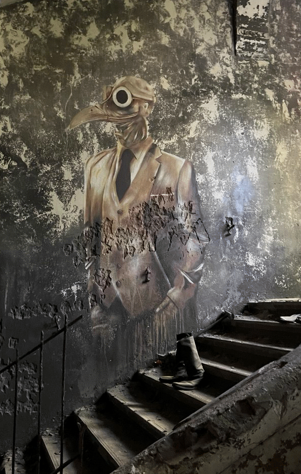
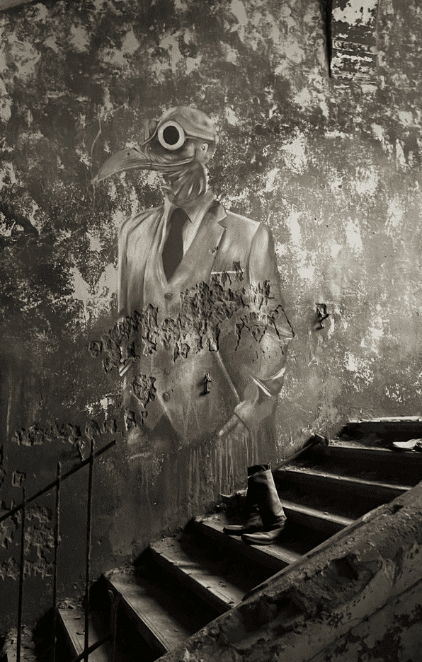
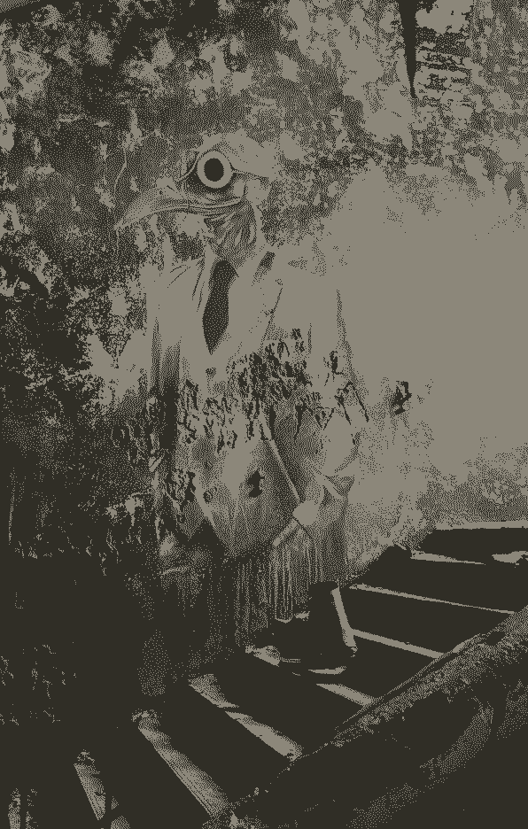
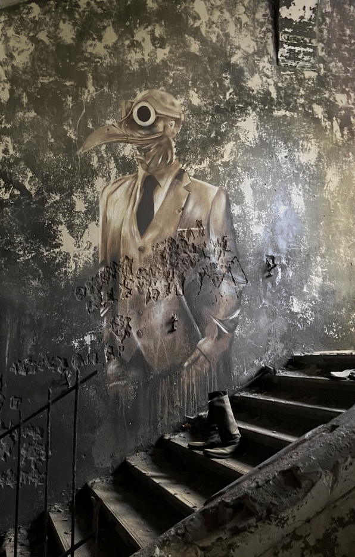

# icy_sixel

A high-performance, 100% pure Rust implementation of a SIXEL encoder and decoder.

I wanted a pure Rust implementation to simplify deployment of my cross-platform applications.
In version 0.4.0, I rewrote the encoder using [quantette](https://github.com/IanManske/quantette),
a high-quality color quantization library licensed under MIT/Apache-2.0. It uses Wu's algorithm
with Floyd-Steinberg dithering for excellent results.

The decoder is a clean-room implementation based on the SIXEL specification, with SIMD optimizations for maximum performance.

## Features

- **SIXEL Encoder**: High-quality color quantization with quantette (Wu's algorithm + Floyd-Steinberg dithering)
- **SIXEL Decoder**: Clean-room implementation with RGBA output and SSE2 SIMD acceleration
- **Transparency Support**: Full alpha channel handling in both encoder and decoder
- **Pixel Aspect Ratio**: Configurable P1 parameter (1:1, 2:1, 3:1, 5:1) for VT340 compatibility
- **Background Mode**: Control transparency behavior with P2 parameter (opaque/transparent)
- **Pure Rust**: No C dependencies, easy to build and deploy
- **Cross-platform**: Works on Linux, macOS, and Windows

## Installation

Add this to your `Cargo.toml`:

```toml
[dependencies]
icy_sixel = "0.7"
```

## Usage

### Encoding an Image to SIXEL

```rust
use icy_sixel::SixelImage;

// RGBA image data (4 bytes per pixel)
let rgba = vec![
    255, 0, 0, 255,   // Red pixel
    0, 255, 0, 255,   // Green pixel
    0, 0, 255, 255,   // Blue pixel
];

let image = SixelImage::try_from_rgba(rgba, 3, 1)?;
let sixel = image.encode()?;
print!("{}", sixel);
```

### Encoding with Custom Options

```rust
use icy_sixel::{BackgroundMode, EncodeOptions, PixelAspectRatio, QuantizeMethod, SixelImage};

// RGBA image data (4 bytes per pixel)
let rgba = vec![255, 0, 0, 255];
let width = 1;
let height = 1;

let options = EncodeOptions {
    max_colors: 64,                              // Use only 64 colors (2-256)
    diffusion: 0.875,                            // Floyd-Steinberg dithering strength (0.0-1.0)
    quantize_method: QuantizeMethod::Wu,         // or QuantizeMethod::kmeans()
};

let image = SixelImage::try_from_rgba(rgba, width, height)?
    .with_aspect_ratio(PixelAspectRatio::Square)      // 1:1 pixels (modern terminals)
    .with_background_mode(BackgroundMode::Transparent); // Undrawn pixels stay transparent

let sixel = image.encode_with(&options)?;
```

### Decoding SIXEL to Image Data

```rust
use icy_sixel::SixelImage;

let sixel_data = b"\x1bPq#0;2;100;0;0#0~-\x1b\\";
let image = SixelImage::decode(sixel_data)?;
// image.pixels contains RGBA pixel data (4 bytes per pixel)
// image.width and image.height contain dimensions
```

### Incremental Payload Decoding

`SixelDecoder::begin_frame()` starts a streaming session after your ANSI parser
has recognized the DCS header and consumed `q`. Feed arbitrary byte chunks without
buffering the complete payload:

```rust
use icy_sixel::{DcsSettings, SixelDecoder, SixelFeedStatus};

let mut decoder = SixelDecoder::new();
let mut frame = decoder.begin_frame(DcsSettings::new(Some(9), Some(1), None))?;
let progress = frame.feed(b"#1;2;100;0;0!1")?;
assert_eq!(progress.status, SixelFeedStatus::NeedMoreData);

let tail = b"2~\x1b\\remaining terminal data";
let progress = frame.feed(tail)?;
assert_eq!(progress.consumed, 2);
assert_eq!(progress.status, SixelFeedStatus::Terminated(0x1b));
let image = frame.finish()?;
assert_eq!(image.dimensions(), (12, 6));
let remaining = &tail[progress.consumed..]; // Return ESC and the rest to your ANSI parser.
```

- Chunk boundaries, including empty chunks, never finish a number, command or image.
- `feed()` reports bytes consumed from that call. CAN, SUB, ESC and all C1 controls
    terminate the payload **without consuming the control byte**. ESC terminates immediately;
    the outer ANSI parser handles the following `\`, even across transport chunks.
- After termination, subsequent calls consume zero bytes and return the same status.
- `finish()` consumes the session, returns the image and commits its palette. It also
    accepts explicit EOF without a terminator, like the one-shot decoder. A strict caller
    can require `Terminated` first. CAN/SUB followed by `finish()` yields the partial image.
- `abort()` or dropping a session discards the image and palette changes, even after a
    terminator. An error invalidates the session; neither `feed()` nor `finish()` can recover
    it. The outer ANSI parser must discard the remainder of that failed DCS.
- Keep the owning `SixelDecoder` for successive images with shared color registers.
    One active session borrows it exclusively. `reset_palette()` resets those registers.

The session retains a fixed-size parser state and the growing RGBA canvas, not the input
stream. Existing canvas limits still apply; this is not constant-memory image storage.
Progressive image previews are not part of this API. To stream the DCS framing as well,
see `begin_dcs()` below.

### Incremental Complete DCS Decoding

If your input includes the DCS framing, use `SixelDecoder::begin_dcs()`. It starts
exactly at `ESC P` or the 8-bit DCS byte `0x90` and parses one SIXEL sequence:

```rust
use icy_sixel::{SixelDecoder, SixelDcsFeedStatus};

let mut decoder = SixelDecoder::new();
let mut dcs = decoder.begin_dcs();
assert_eq!(dcs.feed(b"\x1b")?.status, SixelDcsFeedStatus::NeedMoreData);
assert_eq!(dcs.feed(b"P9;1q#1;2;100;0;0!12~\x1b")?.status,
           SixelDcsFeedStatus::NeedMoreData);
let tail = b"\\terminal text";
let progress = dcs.feed(tail)?;
assert_eq!(progress.status, SixelDcsFeedStatus::Complete);
let remaining = &tail[progress.consumed..]; // "terminal text", ST has been consumed.
let image = dcs.finish()?;
assert_eq!(image.dimensions(), (12, 6));
```

The result's `consumed` count always refers to the current chunk. All header and payload
commands can cross chunk boundaries without accumulating input. Status and byte ownership:

| Status | Meaning / remaining bytes |
|--------|---------------------------|
| `NeedMoreData` | Entire chunk consumed; also returned after a trailing ESC while waiting for lookahead. Empty chunks do not signal EOF. |
| `Complete` | ST (`ESC \\` or `0x9c`) consumed; subsequent terminal data remains untouched. |
| `Cancelled(byte)` | CAN or SUB consumed; `finish()` yields the partial image, `abort()` discards it. |
| `Interrupted(0x1b)` | ESC **already consumed**, possibly in the previous chunk; the following non-backslash byte remains untouched. Resume the outer ANSI parser in its escape state, or prepend ESC to the remainder. |
| `Interrupted(byte)` for other C1 | Control byte **not consumed**; give the entire remainder to the outer ANSI parser. |

- Once terminal, further feeds consume zero bytes and repeat the status.
- `finish()` requires completion, cancellation or interruption. EOF in the introducer,
    header, payload or after a lone ESC is an error. For tolerant EOF use `begin_frame()`.
- A successful `finish()` commits the palette, including changes before cancellation.
    `abort()`, drop and errors discard it. After an error the session cannot recover;
    the outer parser must resynchronize (no consumed count is returned on errors).
- For successive images, finish or abort the session, then call `begin_dcs()` again
    on the same decoder and feed the next DCS. Ordinary text between images remains
    the caller's responsibility.

This adapter does not search arbitrary ANSI streams, skip unrelated control strings,
or accept non-SIXEL DCS headers. If an ANSI parser already handles framing, prefer
`begin_frame()`. Neither API exposes progressive image previews.

### Image Size Limits

Encoding accepts widths up to 1,000,000 pixels. Height rounded up to a complete
six-pixel band must also fit within 1,000,000 pixels (maximum input height: 999,996).
Width times this padded height must not exceed 64 × 1024 × 1024 pixels.
Unsupported sizes return `SixelError::InvalidDimensions`; arithmetic overflow returns
`SixelError::IntegerOverflow`. These limits apply regardless of transparency so
encoded images fit the decoder's canvas limits. They do not guarantee a fixed peak
memory footprint for quantization or canvas growth.

`try_from_rgba()` validates the RGBA buffer, not these codec-specific limits;
`encode()` and `encode_with()` perform the additional checks.

## Architecture

### Encoder

The encoder uses [quantette](https://github.com/IanManske/quantette) for high-quality
color quantization with Wu's algorithm and Floyd-Steinberg dithering. This produces
excellent results, especially for images with gradients or complex color distributions.

### Decoder

The decoder is a clean-room implementation derived from the SIXEL specification:

- Returns RGBA buffers (4 bytes per pixel) for easy integration with graphics libraries
- SIMD-accelerated horizontal span filling on x86/x86_64 (SSE2)
- Optimized with color caching and loop unrolling
- Comprehensive bounds checking prevents buffer overflows

## Showcase

Original image for reference (596×936 pixels, 879 KB PNG):



### Color Palette Comparison (Wu quantizer, full diffusion)

| Colors | SIXEL Size | Result |
|--------|------------|--------|
| 256 | 1.1 MB |  |
| 16 | 440 KB |  |
| 2 | 105 KB |  |

### Dithering Comparison (Wu quantizer, 16 colors)

| Diffusion | SIXEL Size | Result |
|-----------|------------|--------|
| Off (0.0) | 420 KB |  |
| Full (0.875) | 440 KB |  |

### Quantizer Comparison (256 colors, full diffusion)

| Method | SIXEL Size | Result |
|--------|------------|--------|
| Wu | 1.1 MB |  |
| K-means | 1.3 MB |  |

### Encoded SIXEL File Sizes

Complete size matrix for the test image (596×936 pixels):

#### Wu Quantizer

| Colors | Off (0.0) | Low (0.3) | Medium (0.5) | Full (0.875) |
|--------|-----------|-----------|--------------|--------------|
| 256 | 698 KB | 784 KB | 858 KB | 1,066 KB |
| 16 | 420 KB | 427 KB | 432 KB | 439 KB |
| 2 | 71 KB | 84 KB | 93 KB | 105 KB |

#### K-means Quantizer

| Colors | Off (0.0) | Low (0.3) | Medium (0.5) | Full (0.875) |
|--------|-----------|-----------|--------------|--------------|
| 256 | 1,151 KB | 1,182 KB | 1,213 KB | 1,261 KB |
| 16 | 422 KB | 428 KB | 431 KB | 437 KB |
| 2 | 71 KB | 85 KB | 94 KB | 107 KB |

## Benchmarks

Performance measurements on the test image (596×936 pixels, beelitz_heilstätten.png):

### Encoder Performance

| Benchmark | Time |
|-----------|------|
| Default (Wu, 256 colors, full diffusion) | 41.7 ms |

#### Quantizer Comparison

| Quantizer | Time | Notes |
|-----------|------|-------|
| Wu | 41.8 ms | Fast, default |
| K-means | 88.1 ms | 2.1× slower |

#### Color Count Impact

| Colors | Time |
|--------|------|
| 256 | 42.0 ms |
| 16 | 16.3 ms |
| 2 | 10.8 ms |

#### Diffusion Strength Impact

| Diffusion | Time |
|-----------|------|
| Off (0.0) | 21.3 ms |
| Low (0.3) | 31.7 ms |
| Medium (0.5) | 34.1 ms |
| Full (0.875) | 41.9 ms |

### Decoder Performance

The timings below are historical. For the 0.7.0 batch/streaming comparison and
profiling results, see the [decoder benchmark documentation](https://github.com/mkrueger/icy_sixel/blob/main/crates/icy_sixel/benches/README.md).

| Benchmark | Time |
|-----------|------|
| Simple SIXEL | 151 ns |
| Complex SIXEL | 677 ns |
| Repeated patterns | 1.46 µs |

#### Scaling with Size

| Bands | Time |
|-------|------|
| 10 | 1.3 µs |
| 50 | 15.9 µs |
| 100 | 52.6 µs |
| 200 | 209 µs |

#### Color Palette Size

| Colors | Time |
|--------|------|
| 1 | 150 ns |
| 4 | 485 ns |
| 16 | 2.0 µs |
| 64 | 12.4 µs |

*Benchmarks run with `cargo bench` using Criterion on Linux.*

## License

Licensed under either of

- Apache License, Version 2.0 ([LICENSE-APACHE](LICENSE-APACHE))
- MIT license ([LICENSE-MIT](LICENSE-MIT))

at your option.
